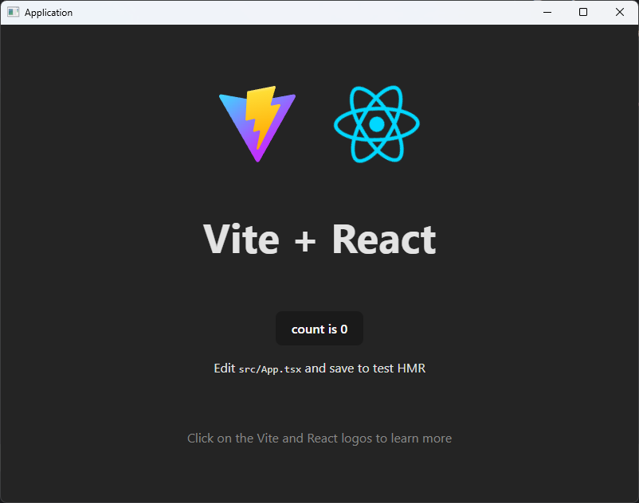

# Application

### Desktop application built with Go and React using WebView and message bus

## Development

Execute the command 
`make dev`

## Build

To build and compress execute the command:
`make build`

